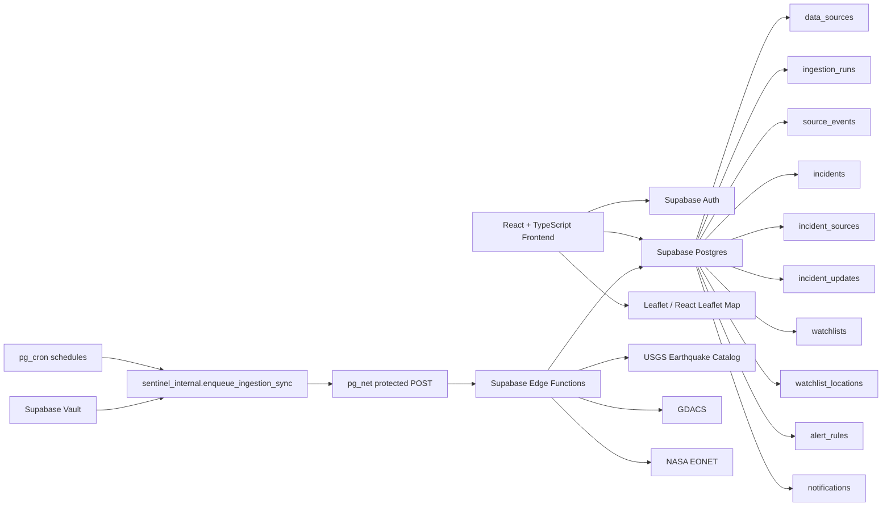

# Sentinel Atlas — Global Disruption Intelligence

A full-stack global disruption intelligence platform for monitoring public hazard-source records, exploring incidents on a real geospatial map, managing private watchlists, and reviewing source trust through a transparent operational dashboard.

[Live Demo](https://sentinel-atlas-global-disruption-in.vercel.app/) · [GitHub Repository](https://github.com/Ashxx1212/sentinel-atlas-global-disruption-intelligence)

---

## Overview

Sentinel Atlas is designed as a global disruption intelligence workspace, not a static analytics dashboard.

The platform helps users move from a high-level operational overview into live source-backed incident records, geospatial context, Incident Rooms, private watchlist relevance, in-app alerts, daily briefing workflows, source health, and data-integrity information.

Sentinel Atlas intentionally separates:

- **Source-backed records** from connected public hazard providers
- **Stored ingestion snapshots** retained when providers are temporarily unavailable
- **Private account-scoped watchlists and alert rules**
- **Server-created in-app notifications**
- **Prototype fixtures** used only where clearly labelled for demonstration context

This distinction avoids presenting prototype data as verified live intelligence, because apparently dashboards should not cosplay as disaster agencies.

---

## Product Preview

<p align="center">
  
</p>

<p align="center">
  
  
</p>

<p align="center">
  
  
</p>

---

## Key Capabilities

### Live hazard-source ingestion

Sentinel Atlas ingests and normalises records from:

- **USGS Earthquake Catalog**
- **GDACS** — Global Disaster Alert and Coordination System
- **NASA EONET** — Earth Observatory Natural Event Tracker

The ingestion layer stores source records, canonical incidents, source evidence, ingestion-run history, and incident updates in Supabase.

### Real geospatial incident map

The Global Map uses a real map basemap with markers plotted from stored latitude and longitude.

Map capabilities include:

- Real geospatial basemap
- Latitude/longitude incident markers
- Zoom and pan
- Marker popups
- Incident preview drawer
- Links from selected incidents to Incident Rooms
- Clear distinction between source-backed records and prototype fixtures

### Secure scheduled refreshes

Live-source refreshes are automated through a protected workflow:

```text
pg_cron → pg_net → protected Supabase Edge Function → public provider API
```

Protected ingestion requests use a Vault-backed token and are not exposed to browser users.

| Source | Refresh Pattern |
|---|---:|
| USGS Earthquake Catalog | Every 15 minutes |
| GDACS | Every 2 hours |
| NASA EONET | Every 4 hours |

### Adaptive NASA EONET coverage

NASA EONET can return large result sets that reach provider limits. Sentinel Atlas uses bounded adaptive coverage logic to improve retrieval safely:

- Per-category source requests
- Closed-event date partitions
- Event-date bisection for saturated result windows
- Maximum provider-request cap
- Fetch-time budget protection
- Clear ingestion metadata for partial-coverage outcomes

### Source health and degraded-provider handling

The Command Centre and Data Trust views communicate:

- Operational or degraded provider status
- Last successful source refresh
- Stored active record count
- Safe user-facing provider-status messaging
- Continued availability of previously stored source-backed records

Raw provider errors, protected request details, tokens, headers, and secrets are not exposed in the browser UI.

### Private in-app alert workflow

Signed-in users can save watchlist locations and create alert rules. The server-side evaluator compares newly changed active source-backed incidents against those saved rules.

The browser can:

- Read the signed-in user’s private notifications
- Mark notifications as read
- Open linked Incident Rooms

The browser cannot:

- Create private alert notifications
- Trigger protected ingestion functions
- Access ingestion secrets
- Backfill historic notifications from newly created rules

When multiple rules match the same incident, Sentinel Atlas coalesces those matches into one private notification to avoid duplicating the same event in the inbox.

---

## Application Areas

| Area | Purpose |
|---|---|
| **Command Centre** | Hybrid operational overview of active incidents, source health, private alerts, and stored source-backed records |
| **Global Map** | Real geospatial exploration of source-backed incidents and labelled prototype fixtures |
| **Incident Rooms** | Incident-level detail, timeline context, source metadata, notification context, and watchlist relevance |
| **My World** | Account-scoped saved locations, enabled alert rules, and private alert feed |
| **Notification Centre** | Private in-app notifications created by the server-side evaluator |
| **Daily Risk Briefing** | Client-side hybrid briefing assembled from incidents, alerts, watchlists, rules, and source health |
| **Data Trust** | Source provenance, integrity labels, source operations, and private alert trust model |
| **Settings** | Watchlist management, alert rules, in-app delivery status, and prototype preferences |

---

## Product Architecture



---

## Data Integrity Model

Sentinel Atlas does not treat every data point as equally validated.

The interface uses source, integrity, and data-mode labels to distinguish between different kinds of information.

| Label | Meaning |
|---|---|
| **Source-backed** | Record stored through a connected source-ingestion workflow |
| **Verified** | Stored source observation or stable traceable record inside Sentinel Atlas |
| **Forecast** | Forward-looking or contextual estimate |
| **Pending** | Limited, incomplete, or reconciliation-pending metadata |
| **Unavailable** | No suitable source-backed value is available for the field |
| **Prototype Fixture** | Local demonstration data, clearly separated from source-backed records |

Sentinel Atlas stores and displays provider observations, but it does not independently validate those observations or issue emergency instructions.

---

## Trust and Safety Boundaries

Sentinel Atlas is an informational intelligence platform. It is **not** an official emergency-warning system.

The application is designed around several trust boundaries:

- Source-backed records are labelled separately from prototype fixtures.
- Private notifications are created server-side, not by browser code.
- Ingestion functions are protected and token-gated.
- Secrets are retrieved from Supabase Vault and are never exposed to the frontend.
- Browser-visible source operations are sanitized summaries.
- Raw provider errors, request headers, protected URLs, and secret-bearing details are not shown in the UI.
- Degraded provider states are shown without exposing sensitive operational details.

---

## Technology Stack

### Frontend

- React
- TypeScript
- Vite
- Tailwind CSS
- React Router
- Leaflet
- React Leaflet
- Lucide React

### Backend and Infrastructure

- Supabase Postgres
- Supabase Auth
- Supabase Edge Functions
- Supabase Vault
- Supabase CLI
- `pg_cron`
- `pg_net`

### Deployment

- Vercel for frontend production deployment
- Supabase for database, authentication, Edge Functions, Vault, and scheduled ingestion

---

## Local Development

### Prerequisites

- Node.js 18 or later
- npm
- A Supabase project for live-data functionality

### Clone the repository

```bash
git clone https://github.com/Ashxx1212/sentinel-atlas-global-disruption-intelligence.git
cd sentinel-atlas-global-disruption-intelligence
npm install
```

### Environment configuration

Create a `.env.local` file in the project root:

```env
VITE_SUPABASE_URL=your_supabase_project_url
VITE_SUPABASE_PUBLISHABLE_KEY=your_supabase_publishable_key
```

Only browser-safe Supabase configuration should be placed in Vite environment variables.

Never expose:

- Supabase service-role keys
- Supabase Vault secrets
- Ingestion tokens
- Provider credentials
- Internal scheduler URLs
- Database connection strings

### Run locally

```bash
npm run dev
```

### Validate before deployment

```bash
npm run typecheck
npm run lint
npm run build
git diff --check
```

---

## Current Scope

Sentinel Atlas was built to demonstrate:

- Full-stack application design
- Live public API ingestion
- Supabase Edge Function development
- Secure scheduled automation
- Database modelling and normalization
- Real geospatial incident mapping
- Source provenance and transparency
- Private in-app alert workflows
- Row-level account-scoped data access
- Operational dashboard UX
- Authentication and protected workspace flow
- Graceful handling of temporarily unavailable providers
- Product thinking around trust, integrity labels, and prototype transparency

---

## Limitations

- Sentinel Atlas is not an official emergency-warning service.
- Provider observations are stored and labelled, not independently verified by Sentinel Atlas.
- Some scenario context remains prototype fixture data and is clearly labelled.
- Private notifications are created only when newly changed active source-backed incidents match saved rules.
- Creating a new alert rule does not backfill historic notifications.

---

## Live Demo

Visit the deployed application:

[https://sentinel-atlas-global-disruption-in.vercel.app/](https://sentinel-atlas-global-disruption-in.vercel.app/)

---

## Author

Built by [Ashank](https://github.com/Ashxx1212)
