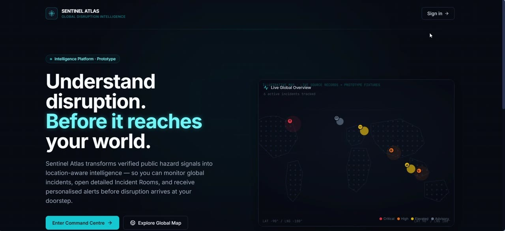
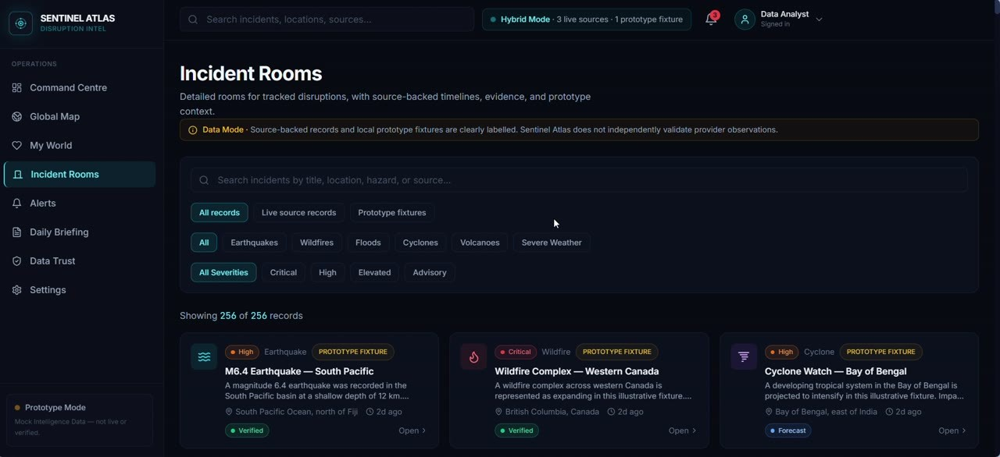
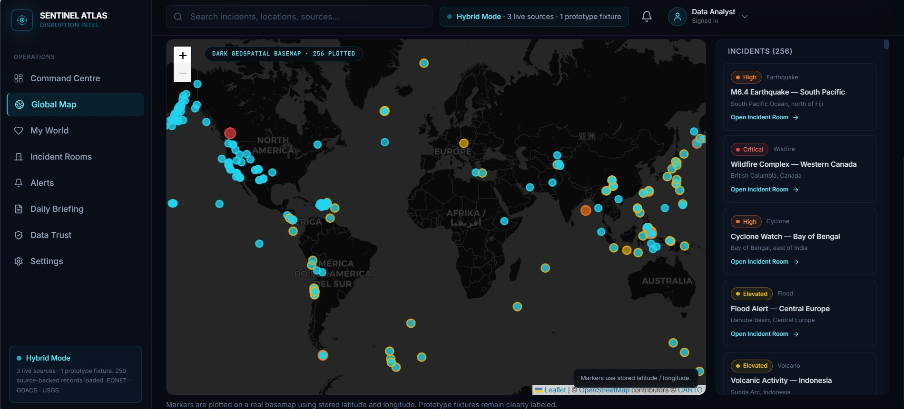
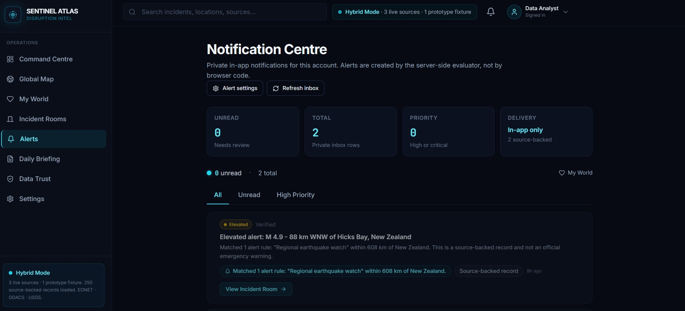
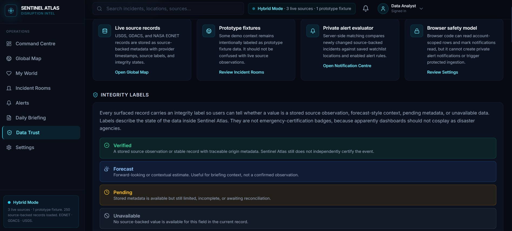
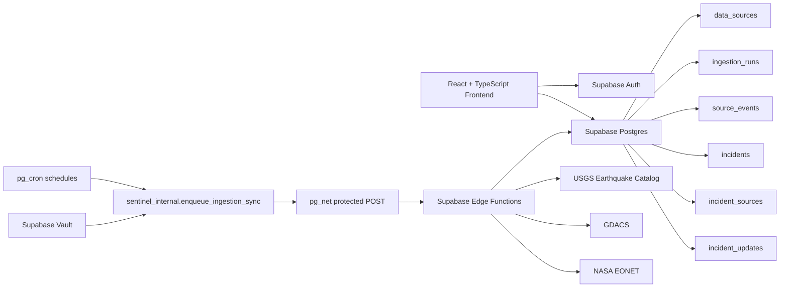

# Sentinel Atlas — Global Disruption Intelligence

A full-stack global disruption intelligence platform that combines live hazard-source ingestion, source-health monitoring, map-based incident exploration, operational workflows, and clearly labelled prototype context.

[Live Demo](https://sentinel-atlas-global-disruption-in.vercel.app/) · [GitHub Repository](https://github.com/Ashxx1212/sentinel-atlas-global-disruption-intelligence)

---

## Overview

Sentinel Atlas is designed as a global disruption intelligence workspace rather than a static analytics dashboard.

It helps users move from a high-level view of active global hazards into source-backed incident records, map context, watchlist relevance, operational alerts, daily briefing workflows, and data-integrity information.

The platform intentionally distinguishes between:

- **Live source-backed records** from connected public providers
- **Stored ingestion snapshots** retained when a provider is temporarily unavailable
- **Prototype fixtures** used for demonstration workflows such as alerts, briefings, and scenario context

This avoids presenting local prototype data as verified live intelligence.
## Product Preview

<p align="center">
  
</p>

<p align="center">
  
  
</p>

<p align="center">
  
  
</p>

---

## Key Capabilities

### Live hazard-source ingestion

Sentinel Atlas ingests and normalises records from:

- **USGS Earthquake Catalog**
- **GDACS** — Global Disaster Alert and Coordination System
- **NASA EONET** — Earth Observatory Natural Event Tracker

The ingestion layer stores source records, canonical incidents, source evidence, ingestion-run history, and incident updates in Supabase.

### Secure scheduled refreshes

Live-source refreshes are automated through a protected workflow:

```text
pg_cron → pg_net → Supabase Edge Function → Public provider API
```

Protected ingestion requests use a Vault-backed token and are not exposed to browser users.

| Source | Refresh Pattern |
|---|---:|
| USGS Earthquake Catalog | Every 15 minutes |
| GDACS | Every 2 hours |
| NASA EONET | Every 4 hours |

### Adaptive NASA EONET coverage

NASA EONET can return large result sets that reach provider limits. Sentinel Atlas uses bounded adaptive coverage logic to improve retrieval safely:

- Per-category source requests
- Closed-event date partitions
- Event-date bisection for saturated result windows
- Maximum provider-request cap
- Fetch-time budget protection
- Clear ingestion metadata for partial-coverage outcomes

### Source health and degraded-provider handling

The Command Centre includes a Live Source Health panel that communicates:

- Operational or degraded provider status
- Last successful source refresh
- Stored active record count
- Safe user-facing provider-status messaging
- Continued availability of previously stored source-backed records

Raw provider errors, internal request data, tokens, headers, and secrets are not exposed in the browser UI.

### Intelligence workflow experience

The application includes:

- Global Command Centre
- Global Hazard Map
- Incident Rooms
- Personalised My World watchlists
- Notification Centre
- Daily Risk Briefing workflow
- Data Trust and provenance view
- Settings and user preferences
- Authentication and workspace access flow

---

## Product Architecture



---

## Data Integrity Model

Sentinel Atlas does not treat every data point as equally validated.

The interface uses source, integrity, and data-mode labels to distinguish between different kinds of information.

| Label | Meaning |
|---|---|
| **Source-backed / Verified** | Record stored through a connected source-ingestion workflow |
| **Forecast** | Contextual or illustrative forecast-related information |
| **Pending** | Reconciliation or operational follow-up state |
| **Unavailable** | No suitable data is available for the field |
| **Prototype Fixture** | Local demonstration data, clearly separated from live source records |

When a provider is temporarily unavailable, Sentinel Atlas retains previously stored source-backed records while clearly displaying the degraded source state.

---

## Application Areas

| Area | Purpose |
|---|---|
| **Command Centre** | Operational overview of active incidents, source health, and stored live-source records |
| **Global Map** | Geographic exploration of active disruption records |
| **My World** | Personal watchlists and location-focused context |
| **Incident Rooms** | Incident-level detail, workflow context, status, and source information |
| **Notification Centre** | Prototype alert rules linked to incidents and watched locations |
| **Daily Risk Briefing** | Rule-based prototype briefing workflow |
| **Data Trust** | Source provenance, integrity labels, and prototype transparency |
| **Settings** | User preferences and workspace configuration |

---

## Technology Stack

### Frontend

- React
- TypeScript
- Vite
- Tailwind CSS
- React Router
- Lucide React

### Backend and Infrastructure

- Supabase Postgres
- Supabase Auth
- Supabase Edge Functions
- Supabase Vault
- Supabase CLI
- `pg_cron`
- `pg_net`

### Deployment

- Vercel for frontend production deployment
- Supabase for database, authentication, Edge Functions, and scheduled ingestion

---

## Local Development

### Prerequisites

- Node.js 18 or later
- npm
- A Supabase project for live-data functionality

### Clone the repository

```bash
git clone https://github.com/Ashxx1212/sentinel-atlas-global-disruption-intelligence.git
cd sentinel-atlas-global-disruption-intelligence
npm install
```

### Environment configuration

Create a `.env.local` file in the project root:

```env
VITE_SUPABASE_URL=your_supabase_project_url
VITE_SUPABASE_PUBLISHABLE_KEY=your_supabase_publishable_key
```

Only browser-safe Supabase configuration should be placed in Vite environment variables.

Never expose:

- Supabase service-role keys
- Supabase Vault secrets
- Ingestion tokens
- Provider credentials
- Internal scheduler URLs
- Database connection strings

### Run locally

```bash
npm run dev
```

### Validate before deployment

```bash
npm run typecheck
npm run build
git diff --check
```

---

## Security Notes

- Browser users access only public-safe application data through the Supabase client.
- Protected ingestion functions use a custom ingestion token.
- Scheduled refreshes retrieve protected values through Supabase Vault.
- Scheduler helper routines are not intended for public browser use.
- Raw provider errors, request headers, tokens, and secret-bearing URLs are not shown in the frontend.
- Live-source status is communicated through safe user-facing operational messages.

---

## Current Scope

Sentinel Atlas was built to demonstrate:

- Full-stack application design
- Live public API ingestion
- Supabase Edge Function development
- Secure scheduled automation
- Database modelling and normalisation
- Source provenance and transparency
- Operational dashboard UX
- Authentication and protected workspace flow
- Graceful handling of temporarily unavailable providers
- Product thinking around trust, integrity labels, and prototype transparency

The application is not an official emergency-warning system and does not independently validate provider observations.

---

## Live Demo

Visit the deployed application:

[https://sentinel-atlas-global-disruption-in.vercel.app/](https://sentinel-atlas-global-disruption-in.vercel.app/)

---

## Author

Built by [Ashank](https://github.com/Ashxx1212)